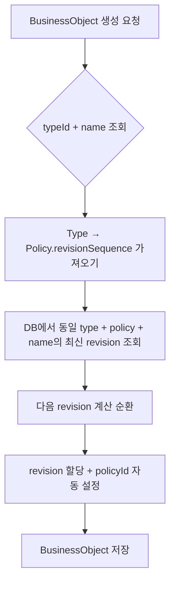

# BusinessObject 리비전 자동 할당 시스템

## 1. 개요

| 항목 | 설명 |
|------|------|
| `Policy` | 리비전 순서(`revisionSequence`) 통합 관리 |
| `Type` | `type`(유니크) + `name`(참고용, 중복 허용) + 계층 구조 |
| `BusinessObject` | `typeId + policyId + name + revision` 기준 리비전 순환 |
| 자동 생성 | `name`, `revision` 자동 할당 |
| 정책 추적 | `BusinessObject`에 `policyId` 명시적 저장 |

---

## 2. 아키텍처 다이어그램

### 2.1 전체 구조 (ASCII)

```
Policy
└── revisionSequence: "A,B,C"
    └── Type (type: "invoice", prefix: "INV", policyId: "p1")
        └── Type (type: "tax-invoice", prefix: "TAX", parentId: "inv1")
            └── BusinessObject (name: "송장-001", revision: "A", policyId: "p1")
                └── BusinessObject (name: "송장-001", revision: "B", policyId: "p1")
```

### 2.2 ERD (Entity Relationship Diagram)

```
[Policy] 1 ──< * [Type] * >── 1 [Type] (parent)
    │                 │
    │                 │
    *                 *
[BusinessObject] >── 1 [Type]
```

### 2.3 리비전 순환 흐름도



---

## 3. Prisma 스키마

### 3.1 Policy 모델

```prisma
model Policy {
  id               String   @id @default(cuid())
  name             String
  version          Int      @default(1)
  revisionSequence String   @default("A,B,C")  // 리비전 순서 관리
  isActive         Boolean  @default(true)

  types    Type[]
  businessObjects  BusinessObject[]

  @@unique([name, version])
  @@index([isActive])
}
```

**핵심:**
- `revisionSequence`: 콤마로 구분된 리비전 순서 (예: "A,B,C")
- 모든 BusinessObject는 이 순서를 따름

---

### 3.2 Type 모델

```prisma
model Type {
  id          String   @id @default(cuid())
  type        String   @unique           // 고유 타입 식별자
  name        String?                    // 사용자 친화적 이름 (중복 허용)
  prefix      String?                    // 접두사 (예: "INV", "TAX")
  description String?
  
  policyId    String
  policy      Policy   @relation(fields: [policyId], references: [id])
  
  // 계층 구조
  parentId    String?
  parent      Type?  @relation("TypeHierarchy", fields: [parentId], references: [id])
  children    Type[] @relation("TypeHierarchy")
  
  objects     BusinessObject[] @relation("TypeObjects")

  @@index([type])
  @@index([policyId])
  @@index([parentId])
}
```

**특징:**
- `type`: 유니크 (예: "invoice", "tax-invoice")
- `name`, `prefix`: nullable, 상속 가능 (부모로부터)
- 계층 구조: Self-referencing (parent-children)

---

### 3.3 BusinessObject 모델

```prisma
model BusinessObject {
  id             String   @id @default(cuid())
  
  // 리비전 시스템
  typeId String?
  name           String?           // "송장-2025-001"
  revision       String?           // "A", "B", "C"
  
  policyId       String
  currentState   String
  data           Json?

  type Type? @relation("TypeObjects", fields: [typeId], references: [id])
  policy       Policy        @relation(fields: [policyId], references: [id])

  @@unique([typeId, policyId, name])           // 정책 내 이름 중복 방지
  @@unique([typeId, name, revision])           // 이름 + 리비전 유니크
  @@index([typeId, policyId, name, revision]) // 복합 인덱스
}
```

**유니크 제약:**
- `(typeId, name, revision)`: 이름 + 리비전 조합 유니크

**설명:**
- 동일한 `name`으로 여러 `revision`을 만들 수 있음 (예: "송장-001-A", "송장-001-B", "송장-001-C")
- 단, 동일한 `name + revision` 조합은 불가 (예: "송장-001-A"가 이미 있으면 다시 "송장-001-A" 생성 불가)

---

## 4. 리비전 자동 할당 로직

### 4.1 Prisma Middleware

**파일:** `src/lib/prisma/middleware.ts`

```typescript
export function registerRevisionMiddleware(prisma: PrismaClient) {
  prisma.$use(async (params, next) => {
    if (params.model === 'BusinessObject' && params.action === 'create') {
      const { typeId, name } = params.args.data

      if (typeId) {
        // 1. Type → Policy 조회
        const type = await prisma.type.findUnique({
          where: { id: typeId },
          select: {
            policyId: true,
            policy: { select: { revisionSequence: true } },
          },
        })

        // 2. policyId 자동 할당
        params.args.data.policyId = type.policyId

        // 3. name 자동 생성 (없을 경우)
        if (!name) {
          const inheritedAttrs = await getInheritedTypeAttributes(typeId)
          const timestamp = new Date().toISOString().split('T')[0].replace(/-/g, '')
          const random = Math.floor(Math.random() * 1000).toString().padStart(3, '0')
          params.args.data.name = `${inheritedAttrs.prefix}-${timestamp}-${random}`
        }

        // 4. revision 자동 할당
        const sequence = type.policy.revisionSequence.split(',').map(s => s.trim())

        const latest = await prisma.businessObject.findFirst({
          where: { typeId, policyId: type.policyId, name },
          orderBy: { createdAt: 'desc' },
          select: { revision: true },
        })

        let nextRevision: string
        if (!latest) {
          nextRevision = sequence[0]  // 첫 번째
        } else {
          const idx = sequence.indexOf(latest.revision)
          nextRevision = sequence[(idx + 1) % sequence.length]  // 순환
        }

        params.args.data.revision = nextRevision
      }
    }

    return next(params)
  })
}
```

**핵심 로직:**
1. `typeId` 존재 시에만 동작
2. `policyId` 자동 할당 (Type의 policyId)
3. `name` 자동 생성 (prefix + timestamp + random)
4. `revision` 순환 계산 (A → B → C → A...)

---

### 4.2 속성 상속 로직

**파일:** `src/lib/business-type-utils.ts`

```typescript
export async function getInheritedTypeAttributes(
  typeId: string
): Promise<{ prefix: string; name: string }> {
  const type = await prisma.type.findUnique({
    where: { id: typeId },
    select: { type, name, prefix, parentId },
  })

  // prefix 상속
  let prefix = type.prefix
  if (!prefix && type.parentId) {
    const parentAttrs = await getInheritedTypeAttributes(type.parentId)
    prefix = parentAttrs.prefix
  }
  prefix = prefix || 'DOC'

  // name 상속 (동일 로직)
  let name = type.name || type.type

  return { prefix, name }
}
```

**재귀 상속:**
- `prefix`가 없으면 부모에서 조회
- 루트까지 없으면 `'DOC'` 기본값

---

## 5. 마이그레이션

### 5.1 SQL 스크립트

**파일:** `prisma/migrations/add_business_type_revision.sql`

```sql
-- 1. Policy에 revisionSequence 추가
ALTER TABLE "Policy"
ADD COLUMN IF NOT EXISTS "revisionSequence" TEXT NOT NULL DEFAULT 'A,B,C';

-- 2. Type 테이블 생성
CREATE TABLE "Type" (
  "id" TEXT PRIMARY KEY,
  "type" TEXT UNIQUE NOT NULL,
  "name" TEXT,
  "prefix" TEXT,
  "policyId" TEXT NOT NULL REFERENCES "Policy"("id") ON DELETE CASCADE,
  "parentId" TEXT REFERENCES "Type"("id"),
  ...
);

-- 3. BusinessObject에 컬럼 추가
ALTER TABLE "BusinessObject"
ADD COLUMN "typeId" TEXT,
ADD COLUMN "name" TEXT,
ADD COLUMN "revision" TEXT;

-- 4. 유니크 제약
ALTER TABLE "BusinessObject"
ADD CONSTRAINT "BusinessObject_typeId_policyId_name_key"
UNIQUE ("typeId", "policyId", "name");
```

### 5.2 마이그레이션 실행

```bash
# Supabase SQL Editor에서 직접 실행
# 또는 psql로 실행
psql $DATABASE_URL -f prisma/migrations/add_business_type_revision.sql

# Prisma Client 재생성
npx prisma generate
```

---

## 6. 사용 예시

### 6.1 Policy 생성

```typescript
const policy = await prisma.policy.create({
  data: {
    name: '송장 정책',
    version: 1,
    revisionSequence: 'A,B,C,D',  // 4단계
  },
})
```

---

### 6.2 Type 생성 (계층)

```typescript
// 1. 부모 타입
const invoiceType = await prisma.type.create({
  data: {
    type: 'invoice',
    name: '일반 송장',
    prefix: 'INV',
    policyId: policy.id,
  },
})

// 2. 자식 타입 (상속)
const taxInvoiceType = await prisma.type.create({
  data: {
    type: 'tax-invoice',
    name: '세금 계산서',
    prefix: 'TAX',
    policyId: policy.id,
    parentId: invoiceType.id,  // 부모 지정
  },
})
```

---

### 6.3 BusinessObject 생성 (자동 할당)

```typescript
// 첫 번째 객체
const obj1 = await prisma.businessObject.create({
  data: {
    typeId: invoiceType.id,
    name: '송장-2025-001',  // 수동 지정
    currentState: 'draft',
  },
})
// 결과: { revision: 'A', policyId: 'p1' }

// 두 번째 객체 (동일 이름)
const obj2 = await prisma.businessObject.create({
  data: {
    typeId: invoiceType.id,
    name: '송장-2025-001',
    currentState: 'draft',
  },
})
// 결과: { revision: 'B', policyId: 'p1' }

// name 자동 생성
const obj3 = await prisma.businessObject.create({
  data: {
    typeId: taxInvoiceType.id,
    // name 생략 → 자동 생성
    currentState: 'draft',
  },
})
// 결과: { name: 'TAX-20251102-042', revision: 'A', policyId: 'p1' }
```

---

## 7. 리비전 순환 시나리오

| 순서 | name | revision | 설명 |
|------|------|----------|------|
| 1 | 송장-001 | A | 첫 생성 |
| 2 | 송장-001 | B | 두 번째 |
| 3 | 송장-001 | C | 세 번째 |
| 4 | 송장-001 | A | **순환** (D 없으면 A로) |

**순환 로직:**
```javascript
const idx = sequence.indexOf(current)  // 현재 인덱스
const next = sequence[(idx + 1) % sequence.length]  // 다음 (순환)
```

---

## 8. 계층 구조 예시

```
Policy (revisionSequence: "A,B,C")
│
├── Type (type: "document", prefix: "DOC")
│   └── Type (type: "contract", prefix: "CON", parentId: "document")
│       └── BusinessObject (name: "CON-20251102-001", revision: "A")
│
└── Type (type: "invoice", prefix: "INV")
    └── Type (type: "tax-invoice", prefix: null, parentId: "invoice")
        └── BusinessObject (name: "INV-20251102-042", revision: "A")
        //                    ^^^ 부모로부터 prefix 상속
```

---

## 9. 유틸리티 함수

### 9.1 계층 구조 조회

```typescript
import { getTypeHierarchy } from '@/lib/business-type-utils'

const hierarchy = await getTypeHierarchy(taxInvoiceType.id)
// 결과: ["document", "invoice", "tax-invoice"]
```

### 9.2 트리 조회

```typescript
import { getTypeTree } from '@/lib/business-type-utils'

const tree = await getTypeTree(policy.id)
// 결과: 계층 구조 트리 (children 포함)
```

---

## 10. 성능 최적화

### 10.1 복합 인덱스

```prisma
@@index([typeId, policyId, name, revision])
```

**효과:**
- 최신 revision 조회 속도 향상
- 유니크 제약 검증 빠름

### 10.2 카운트 최적화

```typescript
// ❌ 전체 조회 후 카운트
const objects = await prisma.businessObject.findMany({ where: { policyId } })
const count = objects.length

// ✅ 카운트만 조회
const count = await prisma.businessObject.count({ where: { policyId } })
```

---

## 11. 주의사항

### 11.1 유니크 제약

**허용:**
```typescript
// ✅ 동일한 name으로 여러 revision 생성 가능
await prisma.businessObject.create({
  data: {
    typeId: 'type1',
    name: '송장-001',
    // revision 자동: 'A'
  },
})

await prisma.businessObject.create({
  data: {
    typeId: 'type1',
    name: '송장-001',
    // revision 자동: 'B' (순환)
  },
})
// ✅ 성공!
```

**불가:**
```typescript
// ❌ 동일한 name + revision 중복 생성 불가
await prisma.businessObject.create({
  data: {
    typeId: 'type1',
    name: '송장-001',
    revision: 'A',  // 수동 지정
  },
})

await prisma.businessObject.create({
  data: {
    typeId: 'type1',
    name: '송장-001',
    revision: 'A',  // ❌ 중복!
  },
})
// → P2002: Unique constraint failed
```

**권장:**
- revision은 자동 할당에 맡기기 (Extension이 순환 처리)
- 수동으로 revision 지정 시 중복 주의

---

### 11.2 revisionSequence 변경 주의

```typescript
// Policy의 revisionSequence를 변경하면
// 기존 BusinessObject의 revision이 유효하지 않을 수 있음

await prisma.policy.update({
  where: { id: 'p1' },
  data: { revisionSequence: 'X,Y,Z' },  // A,B,C → X,Y,Z
})

// 기존 객체: revision='A' → 새 시퀀스에 없음 → 에러
```

**권장:**
- revisionSequence는 Policy 생성 시 한 번만 설정
- 변경 시 기존 데이터 마이그레이션 필요

---

## 12. 확장 가능성

### 12.1 리비전 메타데이터

```typescript
// BusinessObject에 추가 가능
{
  revisionMetadata: {
    previousRevision: 'A',
    changedBy: 'userId',
    changedAt: '2025-11-02T10:00:00Z',
  }
}
```

### 12.2 리비전 히스토리

```typescript
model RevisionHistory {
  id               String   @id @default(cuid())
  businessObjectId String
  revision         String
  createdAt        DateTime @default(now())
  createdBy        String

  @@index([businessObjectId])
}
```

---

## 13. 결론

| 항목 | 설명 |
|------|------|
| **일관성** | Policy의 revisionSequence 기준으로 모든 객체 통일 |
| **자동화** | name, revision, policyId 자동 할당 |
| **추적성** | policyId 명시적 저장으로 정책 변경 추적 |
| **확장성** | 계층 구조 + 속성 상속으로 유연한 설계 |
| **성능** | 복합 인덱스로 빠른 조회 |

**핵심 장점:**
- ✅ 리비전 순환 자동화 (A → B → C → A...)
- ✅ 계층 구조 지원 (부모-자식)
- ✅ 속성 상속 (prefix, name)
- ✅ 정책 추적 (policyId)
- ✅ 확장 가능 (메타데이터, 히스토리)

---

## 14. 참고 자료

- [Prisma Middleware 문서](https://www.prisma.io/docs/concepts/components/prisma-client/middleware)
- [Prisma Schema 문서](https://www.prisma.io/docs/concepts/components/prisma-schema)
- [Self-referencing Relations](https://www.prisma.io/docs/concepts/components/prisma-schema/relations#self-relations)

